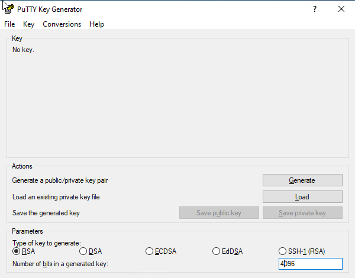
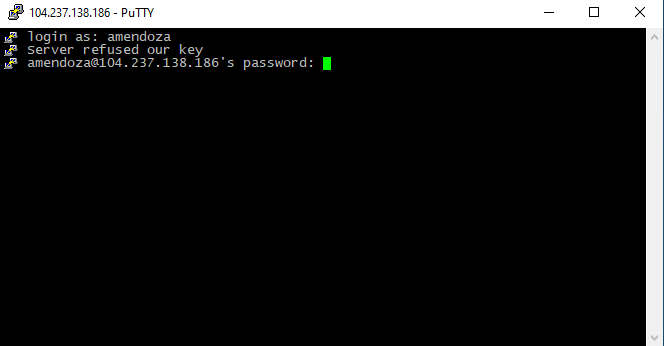

.. _setup_pc:

SSH client (for PC)
===================

**Note:** *If you are using MacOSX as a OS, then you don't need to install PuTTY. Instead you will use the terminal*

PuTTY is an SSH and telnet client for Windows, developed originally by Simon Tatham. It is open source  developed and supported by a group of volunteers. 

Download and install PuTTY's latest version following the instructions from `here <https://www.chiark.greenend.org.uk/~sgtatham/putty/latest.html>`_ 

Setting up SSH client
----------------------------

After you finish installing PuTTY, you should have something similar to this:

.. figure:: ./images/PuttyInstalled.png
    :alt: alt textt
    :align: center
    :scale: 50 %

    Make sure you have PuTTY and PuTTYgen Installed

Make sure that both PuTTY and PuTTYgen were successfully installed. The first one is the ssh client and the second is how we will generate the SSH Keys for authentication.

Creating SSH Keys
-----------------

Before connecting using SSH, you need to create your private and public SSH Keys (refer to `Use SSH Public Key Authentication <https://www.linode.com/docs/guides/use-public-key-authentication-with-ssh/>`_ to understand more about SSH Keys)

Start PuTTYgen and select RSA and change **Number of bits in a generated key** from 2048 to 4094.

    Change 'number of bits in a generated key' to 4096

Then hit the **Generate** button and keep moving the mouse to induce randomness into the key

.. figure:: ./images/keygen_2.png
    :alt: alt textt
    :align: center
    :scale: 70 %

    Keep moving the mouse!

once the key is created, you can secure it by adding a passphrase (simple put, a password). This is not required, but it is a good practice. Do not forget what the password is, as it will be used later in the process to connect to the remote server.

.. figure:: ./images/keygen_3.png
    :alt: alt textt
    :align: center
    :scale: 70 %

    Enter keypassphrase to protect your ssh key

Now, save the **private key** file. Note that the file extension is *.ppk*

.. figure:: ./images/keygen_4.png
    :alt: alt textt
    :align: center
    :scale: 50 %

    Make sure to keep the file extension as ppk

.. _ssh_public_key:    

Next, we need to select the public key. Right click on the area where the publick key is displayed, and then click *select all* and then copy. 

Then, open Notepad and paste the value and save it as *.txt* (do not use a different format or the key would be altered). Keep this file at hand, :ref:`it will be used in a follow step to create the remote authorization file<auth_file>`.

.. figure:: ./images/keygen_5.png
    :alt: alt textt
    :align: center
    :scale: 50 %

    select all 

.. figure:: ./images/keygen_6.png
    :alt: alt textt
    :align: center
    :scale: 50 %

    then copy your public key

.. admonition:: saving public key file from PuTTYgen

    While there is an option to save a public key file from PuTTYgen, it will modify the format of the file. It is preferable to copy/paste it and save it using Notepad as a text file, as explained above.

Configuring SSH Client
------------------------

Now that you have your SSH Keys public and private in place, we can configure our client by starting PuTTY. You should see the PuTTY Configuration window.

Go to Category -> Session and enter *Host Name (or IP address)* as indicated by your instructor. Also, give a name to *Saved Sessions* (e.g. RockstarsG6) and hit Save button. You should see something similar to the image below

.. figure:: ./images/putty_1.png
    :alt: alt textt
    :align: center
    :scale: 70 %

    Enter Hostname and a name for your session. Hit Save button.

Then move to Category -> *Connection* -> *Auth* and click the button *Browse*. Here you will enter the private key file that you saved in the previous section. Be sure that it is the one with extension *ppk*.

    Select Private Key file saved before.

These are all the configurations that we would need to make PuTTY work, but you may want to customized it further to have a better experience using the console. This link `improve putty settings on windows <https://www.linux.com/training-tutorials/improving-putty-settings-windows/#:~:text=Choose%20a%20good%20font.,Lucida%20Console%2C%209%2Dpoint.>`_ could help you to do so.

Now that you have all the files ready, the next step would be connecting to the remote server. Do not close PuTTY!

Remote server connection
------------------------

Once everything is setup, it is time to connect to the remote server.

.. figure:: ./images/putty_1.png
    :alt: alt textt
    :align: center
    :scale: 70 %

    Select your session and Load it before clicking Open.

On PuTTY, go back to *Session* and make sure that you are on your saved one (e.g. RockstarsG6). Then click *Open*. 

If everything was configured OK, you should get a Security Alert windows, telling you that this is the first time you are connecting to the server. Click Accept.

.. figure:: ./images/putty_6.png
    :alt: alt textt
    :align: center
    :scale: 70 %

    PuTTY Security Alert.

Enter your username as prompted and hit return key

    Enter your username.

You will see a message telling you that the server refused the key. This is OK as the public file has not being uploaded yet (this is going to be done in the next step).

Meanwhile we are going to use a password to connect into the remote server (note that this **is not** the passphrase you entered to protect your private file, but the password provided to you by your instructor). 

.. figure:: ./images/putty_8.png
    :alt: alt textt
    :align: center
    :scale: 70 %

After you enter your password, you will see something similar to this. **Congratulations!** you are now connected to the remote unix server!

In the next section you will configure your account to connect using SSH Key instead of password, making the connection more secure.